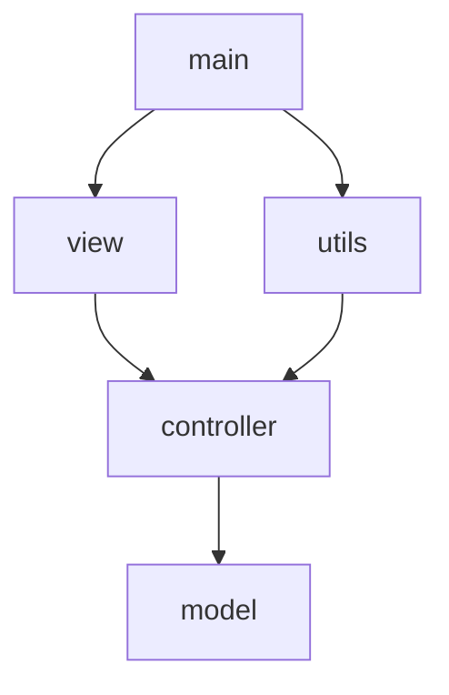

<!--
_header: ''
_footer: ''
_paginate: false
-->

# Implementación de POO
## Sistema de Gestión de Clínica Veterinaria

**Autor**: Jorge  
**Fecha**: Octubre 2025

---

# 📋 Contenido

1. Clases, Objetos y Métodos
2. Encapsulamiento
3. Herencia
4. Polimorfismo
5. Manejo de Colecciones
6. Separación por Paquetes
7. Persistencia con Archivos

---

# 1. Clases, Objetos y Métodos

---

## 1.1 Clases Implementadas

**Modelo de Dominio (model/)**
- `Empleado` - Clase abstracta base
- `Veterinario` - Empleado especializado
- `Asistente` - Empleado de apoyo
- `Mascota` - Pacientes de la clínica
- `Dueno` - Propietarios de mascotas
- `Cita` - Reservaciones médicas
- `Servicio` - Servicios ofrecidos

---

## 1.2 Otras Capas del Sistema

**Controlador (controller/)**
- `ClinicaController` - Gestiona la lógica de negocio

**Vista (view/)**
- `ClinicaView` - Interfaz de usuario por consola

**Utilidades (utils/)**
- `PersistenciaArchivos` - Manejo de archivos

---

## 1.3 Creación de Objetos

```java
// Crear un dueño
Dueno dueno = new Dueno("D001", "Juan Pérez", 
                        "Calle 123", "555-1234", 
                        "juan@email.com");

// Crear una mascota asociada al dueño
Mascota mascota = new Mascota("M001", "Max", "Perro", 
                              "Labrador", 5, 30.5, dueno);

// Crear un veterinario
Veterinario vet = new Veterinario("V001", "Dra. Ana García",
                                  "ana@clinica.com", "555-5678",
                                  "Lunes a Viernes 9-5", "Cirugía");
```

---

## 1.4 Métodos con Funcionalidad Específica

```java
// Método en Mascota para agregar al historial
public void agregarHistorialClinico(String registro) {
    this.historialClinico.add(registro);
}

// Método en Veterinario para diagnosticar
public String diagnosticar(Mascota mascota) {
    return "Veterinario " + getNombre() + 
           " está diagnosticando a " + mascota.getNombre();
}

// Método en Servicio para aplicar descuentos
public double aplicarDescuento(double porcentaje) {
    return precio - (precio * porcentaje / 100);
}
```

---

# 2. Encapsulamiento

---

## 2.1 Atributos Private

**Todas las clases del modelo utilizan atributos privados**

```java
public class Mascota {
    // Atributos privados (no accesibles directamente)
    private String id;
    private String nombre;
    private String especie;
    private String raza;
    private int edad;
    private double peso;
    private List<String> historialClinico;
    private Dueno dueno;
}
```

---

## 2.2 Getters y Setters

```java
// Getter - Obtener valor
public String getNombre() {
    return nombre;
}

// Setter - Modificar valor con validación posible
public void setNombre(String nombre) {
    this.nombre = nombre;
}

// Getter para colección (retorna referencia)
public List<String> getHistorialClinico() {
    return historialClinico;
}
```

---

## 2.3 Beneficios del Encapsulamiento

✅ **Protección de datos**: Los atributos no pueden ser modificados directamente  

✅ **Validación**: Se pueden agregar validaciones en los setters  

✅ **Flexibilidad**: Se puede cambiar la implementación interna sin afectar el código externo  

✅ **Control de acceso**: Solo se exponen los métodos necesarios

---

## 2.4 Ejemplo Completo

```java
public class Dueno {
    private String id;
    private String nombre;
    private List<Mascota> mascotas;
    
    public Dueno(String id, String nombre, String telefono) {
        this.id = id;
        this.nombre = nombre;
        this.mascotas = new ArrayList<>();
    }
    
    // Método controlado para agregar mascotas
    public void agregarMascota(Mascota mascota) {
        if (!mascotas.contains(mascota)) {
            mascotas.add(mascota);
        }
    }
}
```

---

# 3. Herencia

---

## 3.1 Jerarquía de Clases

```typograms
        Empleado (abstract)
              |
      +-------+-------+
      |               |
  Veterinario    Asistente
```

**Clase abstracta `Empleado` como base para herencia**

---

## 3.2 Clase Padre Abstracta

```java
public abstract class Empleado {
    private String id;
    private String nombre;
    private String correo;
    private String telefono;
    private String horario;
    
    public Empleado(String id, String nombre, String correo, 
                    String telefono, String horario) {
        this.id = id;
        this.nombre = nombre;
        // ...
    }
    
    // Método abstracto que DEBE ser implementado
    public abstract String realizarTarea();
}
```

---

## 3.3 Clase Hija - Veterinario

```java
public class Veterinario extends Empleado {
    private String especialidad;
    private List<Cita> citasAsignadas;
    
    // Constructor que llama al constructor padre con super()
    public Veterinario(String id, String nombre, String correo, 
                       String telefono, String horario, 
                       String especialidad) {
        super(id, nombre, correo, telefono, horario); // ← Llamada al padre
        this.especialidad = especialidad;
        this.citasAsignadas = new ArrayList<>();
    }
    
    // Implementación del método abstracto
    @Override
    public String realizarTarea() {
        return "Veterinario " + getNombre() + 
               " está atendiendo consultas médicas.";
    }
}
```

---

## 3.4 Clase Hija - Asistente

```java
public class Asistente extends Empleado {
    private String area;
    
    public Asistente(String id, String nombre, String correo,
                     String telefono, String horario, String area) {
        super(id, nombre, correo, telefono, horario); // ← Llamada al padre
        this.area = area;
    }
    
    @Override
    public String realizarTarea() {
        return "Asistente " + getNombre() + 
               " está apoyando en el área de " + area;
    }
}
```

---

## 3.5 Beneficios de la Herencia

✅ **Reutilización de código**: Atributos y métodos comunes en `Empleado`

✅ **Extensibilidad**: Fácil agregar nuevos tipos de empleados

✅ **Polimorfismo**: Podemos tratar a todos como `Empleado`

✅ **Organización**: Jerarquía clara de relaciones

---

# 4. Polimorfismo

---

## 4.1 Polimorfismo por Sobrescritura (Override)

```java
// En el controlador - POLIMORFISMO EN ACCIÓN
public void mostrarTareasEmpleados() {
    for (Empleado empleado : empleados.values()) {
        // ¡La misma llamada, pero diferente comportamiento!
        System.out.println(empleado.realizarTarea());
    }
}
```

**Salida:**
```
Veterinario Dra. Ana García está atendiendo consultas médicas.
Asistente Carlos López está apoyando en el área de Farmacia.
```

---

## 4.2 Sobrescritura de toString()

```java
// En Mascota
@Override
public String toString() {
    return "Mascota{" +
            "id='" + id + '\'' +
            ", nombre='" + nombre + '\'' +
            ", especie='" + especie + '\'' +
            ", dueño=" + (dueno != null ? dueno.getNombre() : "Sin dueño") +
            '}';
}
```

**Todas las clases sobrescriben `toString()` para dar su propia representación**

---

## 4.3 Polimorfismo por Sobrecarga (Overload)

### Mismo nombre de método, diferentes parámetros

```java
// Versión simple
public String diagnosticar(Mascota mascota) {
    return "Veterinario " + getNombre() + 
           " está diagnosticando a " + mascota.getNombre();
}

// Versión con síntomas adicionales
public String diagnosticar(Mascota mascota, String sintomas) {
    return "Veterinario " + getNombre() + 
           " está diagnosticando a " + mascota.getNombre() + 
           " con síntomas: " + sintomas;
}
```

---

## 4.4 Más Ejemplos de Sobrecarga

**En Asistente:**
```java
public String prepararSala(String numeroSala) {
    return "Preparando sala " + numeroSala;
}

public String prepararSala(String numeroSala, String tipoProcedimiento) {
    return "Preparando sala " + numeroSala + 
           " para " + tipoProcedimiento;
}
```

---

## 4.5 Constructor Sobrecargado

```java
// Constructor básico (para catálogo)
public Servicio(String id, String nombre, 
                String descripcion, double precio) {
    // Inicialización básica
}

// Constructor completo (con mascota y fecha)
public Servicio(String id, String nombre, String descripcion, 
                double precio, Mascota mascota, LocalDate fechaRealizado) {
    // Inicialización completa
}
```

---

## 4.6 Polimorfismo con instanceof

```java
// Filtrar solo veterinarios de la lista de empleados
public List<Veterinario> listarVeterinarios() {
    return empleados.values().stream()
            .filter(e -> e instanceof Veterinario)  // ← Verificar tipo
            .map(e -> (Veterinario) e)              // ← Casting
            .collect(Collectors.toList());
}
```

---

## 4.7 Tipos de Polimorfismo Implementados

| Tipo | Ejemplo | Clase |
|------|---------|-------|
| **Sobrescritura** | `realizarTarea()` | Empleado, Veterinario, Asistente |
| **Sobrescritura** | `toString()` | Todas las clases |
| **Sobrecarga** | `diagnosticar()` | Veterinario |
| **Sobrecarga** | `prepararSala()` | Asistente |
| **Sobrecarga** | Constructor | Servicio |

---

# 5. Manejo de Colecciones

---

## 5.1 HashMap - Almacenamiento Principal

```java
private Map<String, Mascota> mascotas;
private Map<String, Dueno> duenos;
private Map<String, Empleado> empleados;
private Map<String, Cita> citas;
private Map<String, Servicio> servicios;

// Inicialización
public ClinicaController() {
    mascotas = new HashMap<>();
    duenos = new HashMap<>();
    empleados = new HashMap<>();
    citas = new HashMap<>();
    servicios = new HashMap<>();
}
```

---

## 5.2 Operaciones con HashMap

```java
// Agregar
mascotas.put(id, mascota);

// Verificar existencia
if (duenos.containsKey(id)) {
    return false; // ID duplicado
}

// Obtener
Mascota m = mascotas.get(id);

// Eliminar
mascotas.remove(id);

// Obtener todos los valores
List<Mascota> lista = new ArrayList<>(mascotas.values());
```

---

## 5.3 ArrayList - Relaciones Uno a Muchos

**En la clase `Dueno`** (un dueño puede tener varias mascotas):

```java
private List<Mascota> mascotas;

public Dueno(...) {
    this.mascotas = new ArrayList<>();
}

public void agregarMascota(Mascota mascota) {
    if (!mascotas.contains(mascota)) {
        mascotas.add(mascota);
    }
}
```

---

## 5.4 ArrayList en Otras Clases

**En `Veterinario`** (múltiples citas):
```java
private List<Cita> citasAsignadas;
```

**En `Mascota`** (historial clínico):
```java
private List<String> historialClinico;
```

---

## 5.5 Streams y Programación Funcional

```java
// Obtener solo veterinarios
public List<Veterinario> listarVeterinarios() {
    return empleados.values().stream()
            .filter(e -> e instanceof Veterinario)
            .map(e -> (Veterinario) e)
            .collect(Collectors.toList());
}

// Obtener citas de un veterinario específico
public List<Cita> obtenerCitasPorVeterinario(String idVeterinario) {
    return citas.values().stream()
            .filter(c -> c.getVeterinario().getId().equals(idVeterinario))
            .collect(Collectors.toList());
}
```

---

## 5.6 Resumen de Colecciones

| Colección | Uso | Ubicación | Beneficio |
|-----------|-----|-----------|-----------|
| `HashMap<String, Mascota>` | Almacenar mascotas por ID | `ClinicaController` | Búsqueda O(1) |
| `HashMap<String, Dueno>` | Almacenar dueños por ID | `ClinicaController` | Búsqueda O(1) |
| `ArrayList<Mascota>` | Mascotas de un dueño | `Dueno` | Relación 1:N |
| `ArrayList<Cita>` | Citas de un veterinario | `Veterinario` | Relación 1:N |
| `ArrayList<String>` | Historial clínico | `Mascota` | Registro histórico |

---

# 6. Separación por Paquetes

---

## 6.1 Estructura MVC

```
src/
├── model/              ← Clases de dominio (entidades)
│   ├── Empleado.java
│   ├── Veterinario.java
│   ├── Asistente.java
│   ├── Mascota.java
│   ├── Dueno.java
│   ├── Cita.java
│   └── Servicio.java
├── controller/         ← Lógica de negocio
│   └── ClinicaController.java
├── view/               ← Interfaz de usuario
│   └── ClinicaView.java
├── utils/              ← Utilidades generales
│   └── PersistenciaArchivos.java
└── main/               ← Punto de entrada
    └── Main.java
```

---

## 6.2 Paquete `model`

**Responsabilidad**: Clases que representan las entidades del dominio

```java
package model;

public class Mascota {
    // Representa UNA mascota con sus atributos y comportamientos
}
```

✅ Define la estructura de datos
✅ Encapsula atributos con getters/setters
❌ NO conoce la interfaz de usuario
❌ NO contiene lógica de negocio compleja

---

## 6.3 Paquete `controller`

**Responsabilidad**: Coordina la lógica de negocio

```java
package controller;

import model.*;
import java.util.*;

public class ClinicaController {
    private Map<String, Mascota> mascotas;
    
    public boolean registrarMascota(...) {
        // Lógica de validación y registro
    }
}
```

✅ Valida datos antes de procesarlos
✅ Coordina operaciones entre entidades
✅ Implementa reglas de negocio

---

## 6.4 Paquete `view`

**Responsabilidad**: Interacción con el usuario

```java
package view;

import controller.ClinicaController;

public class ClinicaView {
    private ClinicaController controller;
    private Scanner scanner;
    
    public void mostrarMenuPrincipal() {
        // Menús y entrada de datos
    }
}
```

✅ Muestra menús y opciones
✅ Captura entrada del usuario
✅ Delega operaciones al controller

---

## 6.5 Diagrama de Dependencias



---

## 6.6 Beneficios de la Separación

| Beneficio | Descripción |
|-----------|-------------|
| **Mantenibilidad** | Cambios en la vista no afectan el modelo |
| **Reutilización** | El controller puede usarse con diferentes vistas |
| **Testabilidad** | Cada capa se puede probar independientemente |
| **Escalabilidad** | Fácil agregar nuevas funcionalidades |

---

# 7. Persistencia con Archivos

---

## 7.1 Estructura de Archivos

```
datos/
├── duenos.txt       ← Información de dueños
├── mascotas.txt     ← Información de mascotas + historial
├── empleados.txt    ← Veterinarios y asistentes
└── citas.txt        ← Citas programadas
```

---

## 7.2 Formato de Almacenamiento

**duenos.txt**
```
D001|Juan Pérez|Calle 123|555-1234|juan@email.com
```

**mascotas.txt**
```
M001|Max|Perro|Labrador|5|30.5|D001
HISTORIAL:M001:2025-01-15 - Vacunación antirrábica
```

**empleados.txt**
```
VET|V001|Dra. Ana García|ana@clinica.com|555-9999|L-V 9-5|Cirugía
ASI|A001|Carlos López|carlos@clinica.com|555-8888|L-V 8-4|Farmacia
```

---

## 7.3 Clase PersistenciaArchivos

```java
public class PersistenciaArchivos {
    private static final String ARCHIVO_DUENOS = "datos/duenos.txt";
    private static final String ARCHIVO_MASCOTAS = "datos/mascotas.txt";
    private static final String ARCHIVO_EMPLEADOS = "datos/empleados.txt";
    private static final String ARCHIVO_CITAS = "datos/citas.txt";
    
    private ClinicaController controller;
    
    public PersistenciaArchivos(ClinicaController controller) {
        this.controller = controller;
        crearDirectorioDatos();
    }
}
```

---

## 7.4 Guardar Datos

```java
private void guardarDuenos() {
    try (PrintWriter writer = new PrintWriter(new FileWriter(ARCHIVO_DUENOS))) {
        List<Dueno> duenos = controller.listarDuenos();
        for (Dueno dueno : duenos) {
            writer.println(dueno.getId() + "|" + 
                          dueno.getNombre() + "|" + 
                          dueno.getDireccion() + "|" + 
                          dueno.getTelefono() + "|" + 
                          dueno.getCorreo());
        }
    } catch (IOException e) {
        System.err.println("Error: " + e.getMessage());
    }
}
```

---

## 7.5 Guardar con Polimorfismo

```java
for (Empleado empleado : empleados) {
    if (empleado instanceof Veterinario) {
        Veterinario vet = (Veterinario) empleado;
        writer.println("VET|" + vet.getId() + "|" + 
                      vet.getNombre() + "|" + 
                      vet.getEspecialidad());
    } else if (empleado instanceof Asistente) {
        Asistente asist = (Asistente) empleado;
        writer.println("ASI|" + asist.getId() + "|" + 
                      asist.getNombre() + "|" + 
                      asist.getArea());
    }
}
```

---

## 7.6 Cargar Datos

```java
private void cargarDuenos() {
    File archivo = new File(ARCHIVO_DUENOS);
    if (!archivo.exists()) return;
    
    try (BufferedReader reader = new BufferedReader(new FileReader(archivo))) {
        String linea;
        while ((linea = reader.readLine()) != null) {
            String[] datos = linea.split("\\|");
            if (datos.length >= 5) {
                controller.registrarDueno(datos[0], datos[1], 
                                         datos[2], datos[3], datos[4]);
            }
        }
    } catch (IOException e) {
        System.err.println("Error: " + e.getMessage());
    }
}
```

---

## 7.7 Try-With-Resources

**Ventaja**: Cierra automáticamente los archivos

```java
// ✅ Correcto - Se cierra automáticamente
try (PrintWriter writer = new PrintWriter(new FileWriter(archivo))) {
    writer.println("datos");
} // writer se cierra aquí automáticamente
```

---

## 7.8 Características de la Persistencia

✅ **Formato simple**: Archivos de texto legibles  
✅ **Separación de datos**: Un archivo por tipo de entidad  
✅ **Manejo de errores**: Try-catch para IOException  
✅ **Relaciones**: Guarda IDs para reconstruir asociaciones  
✅ **Polimorfismo**: Distingue tipos con prefijos (VET/ASI)  

---

# 📊 Resumen de Conceptos

---

## Tabla Resumen

| Concepto | Implementación | Ubicación |
|----------|----------------|-----------|
| **Clases y Objetos** | 7 clases modelo + controller + view | Todo el proyecto |
| **Encapsulamiento** | Atributos `private` + getters/setters | Todas las clases modelo |
| **Herencia** | `Empleado` → `Veterinario`, `Asistente` | Paquete `model` |
| **Polimorfismo** | Override y Overload | Empleado y subclases |
| **HashMap** | Almacenamiento por ID | `ClinicaController` |
| **ArrayList** | Relaciones 1:N | Dueno, Veterinario, Mascota |
| **MVC** | Separación clara | Estructura de paquetes |
| **Persistencia** | Archivos .txt | `PersistenciaArchivos` |

---

# 🎯 Conclusión

Este proyecto demuestra una **implementación completa** de POO:

1. ✅ **Diseño modular** con separación clara de responsabilidades
2. ✅ **Reutilización de código** mediante herencia
3. ✅ **Flexibilidad** gracias al polimorfismo
4. ✅ **Protección de datos** con encapsulamiento
5. ✅ **Eficiencia** usando colecciones apropiadas
6. ✅ **Persistencia** para mantener datos
7. ✅ **Escalabilidad** con arquitectura MVC

---

<!--
_header: ''
_footer: ''
_paginate: false
-->

# ¡Gracias!

**Sistema de Gestión de Clínica Veterinaria**

Autor: Jorge  
Fecha: Octubre 2025

---
